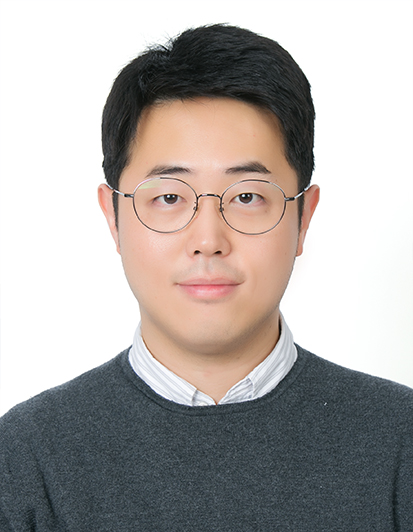

# Welcome!

<!--  -->

<table border="0">
<tr>
    <td>
        
    </td>
    <td>  </td>
 </tr>
</table>

Kyuwook Chai is a Graduate Student at the [Graduate School of Data Science](https://gsds.snu.ac.kr/), Seoul National University (SNU GSDS).  His research interests are in data management, data-driven decision making, reinforcement learning & bandit algorithms, machine learning & deep learning, and technology & innovation. 
Prior to joining SNU GSDS, he served as a patent attorney at [You Me Patent & Law Firm](http://en.youme.com/), [FirstLaw P.C](http://www.firstlaw.co.kr/eng/). and [Haean Patent & Law Firm](https://www.haeanip.com/).  He is a member of the Korean Patent Attorneys Association (KPPA).  He was admitted to the Korean Patent Bar in 2013. 
He completed his undergraduate degree in 2012 at [Seoul National University](https://snu.ac.kr/) double majoring Physics and Statistics.
His emails are [kwchai@snu.ac.kr](mailto:kwchai@snu.ac.kr) & [kyuwookchai@gmail.com](mailtio:kyuwookchai@gmail.com).